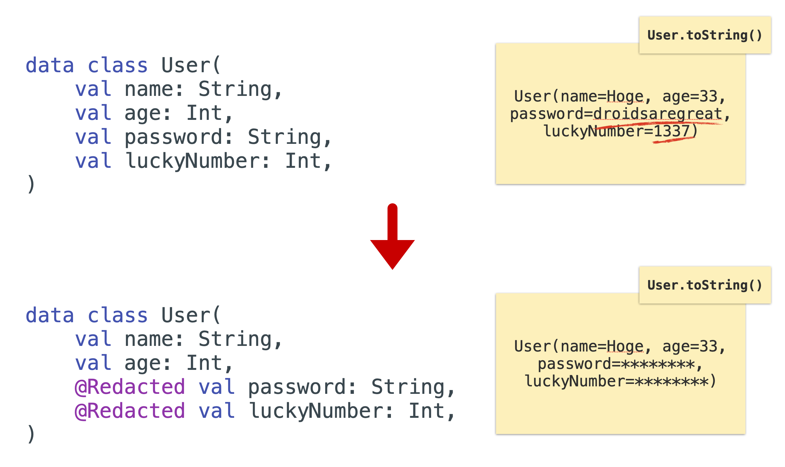

# DroidKaigi 2023: Introduction to Bytecode Instrumentation with AGP 8

Sample repository for the talk given at [DroidKaigi 2023](https://2023.droidkaigi.jp/) in Tokyo, Japan.

## Materials

- View the slides [here](https://bit.ly/dk23-bytecode)
- Watch the recording ~[here]()~ – not yet available!

## Overview

This project demonstrates an exemplary implementation of the new Transform API introduced in Android Gradle Plugin 8.
Using the custom `@Redacted` annotation, developers can mark specific parameters of Kotlin `data classes`
as "sensitive". The bytecode transformer will remove the values of these annotation parameters from the string representation
of that particular class.



The project is divided into three Gradle modules:

- `api` defines two custom marker annotations
- `app` is a basic Jetpack Compose application to showcase the effects of the Transformer at runtime
- `transformer` provides the implementation of the custom Transformer

## License

```
Copyright 2023 Marcel Schnelle

Licensed under the Apache License, Version 2.0 (the "License");
you may not use this file except in compliance with the License.
You may obtain a copy of the License at

  http://www.apache.org/licenses/LICENSE-2.0

Unless required by applicable law or agreed to in writing, software
distributed under the License is distributed on an "AS IS" BASIS,
WITHOUT WARRANTIES OR CONDITIONS OF ANY KIND, either express or implied.
See the License for the specific language governing permissions and
limitations under the License.
```

See also the [full License text](LICENSE).
